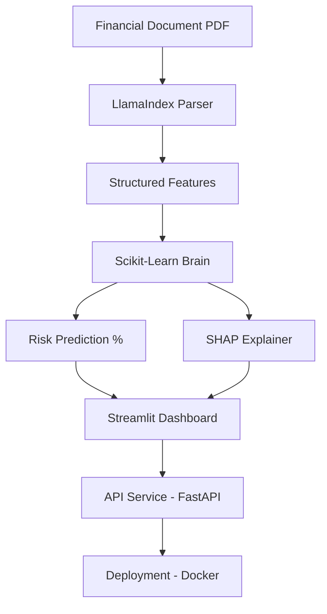

# Intelligent Financial Document Risk Analyzer 🏦 🤖

A production-grade **LLM + ML** system designed to automate financial risk assessment and document analysis. This project combines traditional Machine Learning (Scikit-Learn) for high-speed risk prediction, Explainable AI (SHAP) for transparent decision-making, and Large Language Models (LlamaIndex) for unstructured document parsing.

---

## 🌟 Key Features

- **Automated Risk Scoring**: Uses a Scikit-Learn **Random Forest Classifier** to predict loan default probability based on income, debt, credit score, and employment history.
- **Explainable AI (XAI)**: Integrated **SHAP (SHapley Additive exPlanations)** to provide feature-level transparency. For every high-risk flag, the system explains *why* (e.g., "High debt-to-income ratio increased risk by 15%").
- **Intelligent Document Parsing**: Leverages **LlamaIndex** to extract structured financial features from unstructured PDF applications and bank statements.
- **Production-Ready API**: A high-performance **FastAPI** backend with asynchronous endpoints and Pydantic data validation.
- **Interactive Dashboard**: A sleek **Streamlit** frontend for real-time risk simulation and analytical visualization.
- **MLOps & Monitoring**:
    - **Data Drift Detection**: Automated reports using **Evidently AI** to monitor model performance and feature distribution shifts.
    - **CI/CD**: Fully automated testing and linting via **GitHub Actions**.
    - **Containerization**: Fully **Dockerized** architecture for seamless deployment.

---

## 🏗 System Architecture



---

## 🛠 Tech Stack

- **Languages**: Python 3.10+
- **Machine Learning**: Scikit-Learn, SHAP, Pandas, NumPy
- **LLM Framework**: LlamaIndex, OpenAI
- **Web Backend**: FastAPI, Uvicorn, Pydantic
- **Web Frontend**: Streamlit
- **MLOps**: Evidently AI, GitHub Actions
- **Infrastructure**: Docker

---

## 🚀 Getting Started

### 1. Installation
Clone the repository and install dependencies:
```bash
git clone https://github.com/anushagoli07/Financial-Risk-Analyzer-ML-Project-.git
cd financial-risk-analyzer
pip install -r requirements.txt
```

### 2. Training the Model
Initialize the machine learning model pipeline:
```bash
python -m src.train_model
```

### 3. Launching the Services
Start the Backend API:
```bash
uvicorn api.app:app --reload
```

Start the Frontend Dashboard (in a new terminal):
```bash
streamlit run frontend/dashboard.py
```

---

## 📂 Project Structure

```bash
financial-risk-analyzer/
├── api/             # FastAPI backend implementation
├── data/            # Model artifacts and processed datasets
├── frontend/        # Streamlit UI code
├── src/             # Core ML, LLM, and MLOps logic
│   ├── data_pipeline.py    # Data loading & preprocessing
│   ├── explain_model.py    # SHAP Explainability logic
│   ├── train_model.py      # RF Training script
│   └── monitoring.py       # Evidently drift detection
├── .github/         # CI/CD Workflows
└── Dockerfile       # Container specification
```

---

## 👨‍💻 Portfolio Highlights
- **Transparency**: Solves the "Black Box" problem in fintech using SHAP.
- **Scalability**: Decoupled FastAPI/Streamlit architecture ready for cloud scaling.
- **Reliability**: Integrated data-drift monitoring to ensure model health over time.

---
*Created by **Anusha Goli** - [LinkedIn](https://www.linkedin.com/in/your-profile) | [Portfolio](https://yourportfolio.com)*
